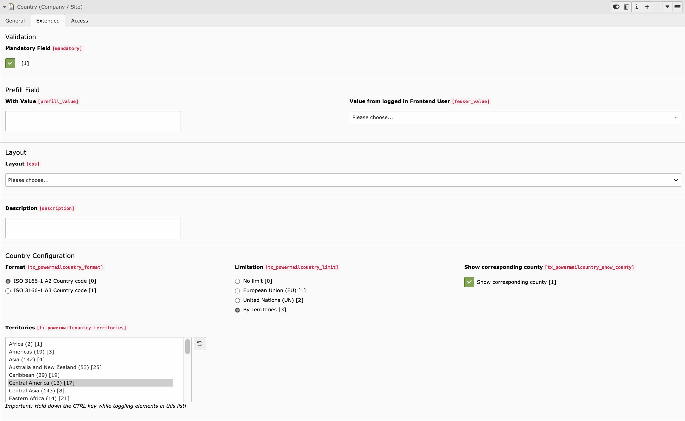
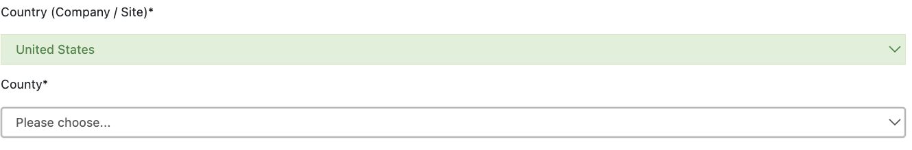
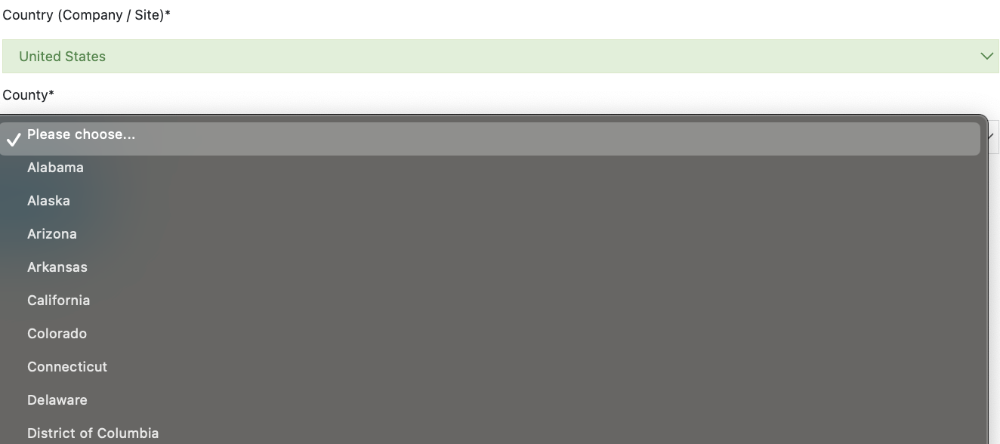

# Belsignum/Powermail-Country
Improve the Powermail select option list
- Option value: Choose between
  - ISO 3166-1 A2/A3 country code
  - English Short Name
  - Custom List
- Limitation
    - All static_countries
    - European Union (EU)
    - United Nations (UN)
    - Territories Select List
- Label value respect current language and static_info_tables_* modifications
- Available Hook to post modify option list
- Dynamic add of available State list for Format Options ISO 3166-1 A2/A3
    - Custom mapping possible by TypoScript

## Requirements
- static_info_tables
- powermail

## Installation
- Install via composer req belsignum/powermail-country
- Add static template

## Backend


## Frontend



## Custom County Mapping
```
# Custom County Mapping
plugin.tx_powermailcountry.settings.mapping {
  country_zones {
    MX {
      AG = Aguascalientes
      BC = Baja California
      BS = Baja California Sur
      ...
    }
    MEX < .MX
  }
}
```

## Changelog
- 11.2.0 - Add English Short Name and Custom Format Option
- 11.1.0 - Add corresponding County Select
- 11.0.0 - Support for TYPO3 v11 (thanks to Frank Gerards)

